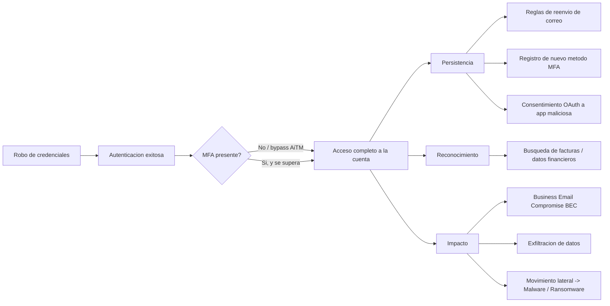

# INC-002 — Contraseña Comprometida · Teoría

> Lectura única. Para el procedimiento operativo, ir a [`Playbook.md`](./Playbook.md).

---

## 1. ¿Qué diferencia esto de INC-001 (Usuario Bloqueado)?

En INC-001, la cuenta se bloquea automáticamente y el usuario **no puede** entrar — el propio sistema contiene el problema. En INC-002 ocurre lo contrario y es más peligroso: **las credenciales son válidas**, no hay bloqueo automático, y un tercero puede estar autenticando con normalidad. El sistema no te avisa; tienes que detectarlo tú a partir de indicadores de comportamiento anómalo.

---

## 2. Vectores habituales de compromiso de credenciales

| Vector | Descripción | Cómo se detecta habitualmente |
|---|---|---|
| **Phishing** | El usuario introduce sus credenciales en un sitio falso | Correlación con INC-003, alerta de EDR/Secure Email Gateway |
| **Reutilización de contraseña filtrada** | La misma contraseña se usó en un servicio externo que sufrió una brecha, y aparece en un dump público | Alertas de *leaked credentials* de Entra ID / Have I Been Pwned / threat intel feed |
| **Malware infostealer** | Malware (RedLine, Raccoon, etc.) en el equipo del usuario exfiltra credenciales guardadas en el navegador | Alerta de EDR, correlación con INC-004 (Malware) |
| **Fuerza bruta / password spraying** | Intentos automatizados de adivinar la contraseña contra múltiples cuentas | Eventos 4625 / 4771 repetidos, alertas de Entra ID Identity Protection |
| **Ataque de intermediario (AiTM) / bypass de MFA** | Kit de phishing tipo Evilginx que captura sesión y token, no solo contraseña | Token replay detectado por Conditional Access / sign-in desde IP y dispositivo no reconocidos inmediatamente después de un intento de phishing |

---

## 3. Cadena de ataque típica (kill chain simplificada)

El objetivo del Playbook es cortar esta cadena lo antes posible, idealmente entre "Autenticación exitosa" y "Persistencia".

---

## 4. Indicadores de compromiso (IOC) más comunes

| Indicador | Dónde se observa | Nivel de confianza |
|---|---|---|
| *Impossible travel* (login desde dos países en un tiempo físicamente imposible) | Entra ID Sign-in logs / Identity Protection | Alto |
| Nueva regla de bandeja de entrada con reenvío a dominio externo desconocido | Exchange Online (`Get-InboxRule`) | Muy alto |
| Nuevo método de MFA registrado que el usuario no reconoce | Entra ID → Authentication methods | Muy alto |
| Consentimiento a una aplicación OAuth de terceros con permisos amplios (`Mail.Read`, `Files.ReadWrite.All`) | Entra ID → Enterprise applications | Alto |
| Múltiples fallos de autenticación (4625/4771) seguidos de un éxito | Security log del DC / Entra ID | Medio (puede ser el propio usuario equivocándose) |
| El propio usuario reporta que no reconoce una actividad (correo enviado, archivo compartido) | Ticket del usuario | Depende de corroboración técnica |

**Ninguno de estos indicadores por sí solo es concluyente.** El Playbook exige corroborar al menos dos señales independientes (o una señal de confianza "muy alta") antes de declarar compromiso confirmado, para evitar contener cuentas legítimas por falsos positivos (ej.: un empleado viajando con VPN corporativa puede parecer "impossible travel").

---

## 5. Relación con otros playbooks

| Situación encontrada durante la investigación | Playbook relacionado |
|---|---|
| El vector de entrada fue un correo de phishing identificado | INC-003 (Phishing) |
| Se encuentra malware en el endpoint del usuario (infostealer) | INC-004 (Malware) |
| Hay indicios de cifrado de archivos o movimiento lateral hacia servidores | INC-005 (Ransomware) — **máxima prioridad**, detener este playbook y escalar |
| El origen fue un bloqueo de cuenta con patrón de ataque detectado en TASK-03 de INC-001 | Este playbook es el destino natural de esa derivación |
| Se han enviado correos fraudulentos a proveedores/clientes desde la cuenta comprometida (BEC) | INC-018 (Correo) para gestión de comunicación y remediación con destinatarios afectados |

---

## 6. Buenas prácticas (mitigación estructural, no solo reactiva)

- **MFA resistente a phishing** (FIDO2 / Windows Hello for Business) en lugar de solo SMS/OTP, que es vulnerable a AiTM.
- **Conditional Access** con políticas de ubicación/dispositivo conocido para reducir la superficie de ataque de credenciales robadas sin dispositivo de confianza.
- **Identity Protection** de Entra ID con políticas de riesgo automatizadas (forzar cambio de contraseña o bloqueo automático ante *sign-in risk* alto).
- **Restricción de consentimiento de usuario a aplicaciones OAuth de terceros** (requerir aprobación de administrador para apps no verificadas).
- Concienciación periódica sobre phishing (reduce el vector más común, ver INC-003).
