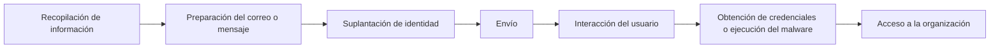

# Teoría - Phishing

## ¿Qué es el phishing?

El phishing es una técnica de ingeniería social utilizada por los atacantes para engañar a un usuario y conseguir que revele información confidencial o ejecute acciones que comprometan la seguridad de la organización.

Su objetivo no suele ser explotar una vulnerabilidad técnica, sino aprovechar el factor humano mediante la suplantación de identidad.

Los atacantes suelen hacerse pasar por:

- Entidades bancarias.
- Proveedores.
- Compañeros de trabajo.
- Departamentos de Recursos Humanos.
- Administradores de sistemas.
- Empresas de mensajería.
- Microsoft 365.
- Google Workspace.
- Organismos públicos.

---

# Objetivos del atacante

Un ataque de phishing puede perseguir diferentes objetivos.

| Objetivo | Descripción |
|----------|-------------|
| Robo de credenciales | Obtener usuario y contraseña. |
| Robo de información | Conseguir documentos confidenciales. |
| Instalación de malware | Convencer al usuario para ejecutar un archivo malicioso. |
| Fraude económico | Realizar transferencias o pagos fraudulentos. |
| Acceso inicial | Obtener acceso a la red corporativa. |
| Distribución de ransomware | Infectar equipos de la organización. |

---

# Funcionamiento de un ataque de phishing

Un ataque de phishing suele seguir un proceso muy similar independientemente del medio utilizado.



---

# Fases del ataque

## 1. Reconocimiento

El atacante recopila información sobre la víctima.

Puede utilizar:

- LinkedIn
- Página web corporativa
- Redes sociales
- Inteligencia Open Source (OSINT)
- Filtraciones de datos

Cuanta más información obtenga, más creíble será el ataque.

---

## 2. Preparación

Se crea el correo, mensaje o página fraudulenta.

Habitualmente se registran dominios similares al original.

Ejemplos:

```
empresa.com
```

↓

```
ernpresa.com
```

```
empresa-login.com
```

```
empresa365.com
```

---

## 3. Envío

El mensaje llega al usuario.

Los medios más habituales son:

- Correo electrónico.
- SMS.
- WhatsApp.
- Teams.
- Telegram.
- Redes sociales.

---

## 4. Interacción

El usuario realiza alguna acción.

Por ejemplo:

- Hace clic en un enlace.
- Descarga un archivo.
- Introduce sus credenciales.
- Escanea un código QR.
- Habilita macros.
- Ejecuta un programa.

---

## 5. Explotación

El atacante obtiene el acceso deseado.

Las consecuencias dependerán del objetivo del ataque.

---

# Tipos de phishing

## Email Phishing

Es el más común.

Se basa en el envío masivo de correos fraudulentos.

---

## Spear Phishing

Ataque dirigido a una persona concreta.

Utiliza información previamente recopilada para aumentar la credibilidad.

Ejemplo:

```
Buenos días Beatriz,

Adjunto la factura pendiente del proveedor con el que trabajaste la semana pasada.
```

---

## Whaling

Dirigido a altos cargos.

Normalmente:

- CEO
- CFO
- Dirección
- Administradores

Suele perseguir fraude económico o robo de información sensible.

---

## Smishing

Utiliza mensajes SMS.

Ejemplo:

```
Su paquete no ha podido entregarse.

Acceda aquí:

https://...
```

---

## Vishing

Se realiza mediante llamadas telefónicas.

El atacante suplanta a:

- Banco.
- Soporte técnico.
- Microsoft.
- Policía.
- Empresa colaboradora.

---

## QR Phishing (Quishing)

El usuario escanea un código QR que redirige a una página fraudulenta.

Cada vez es más frecuente porque muchos filtros de correo no analizan el contenido del QR.

---

# Indicadores de phishing

Un único indicador no confirma un ataque, pero cuantos más aparezcan, mayor será la probabilidad de que el mensaje sea fraudulento.

| Indicador | Riesgo |
|-----------|--------|
| Dominio extraño | Alto |
| Errores ortográficos | Medio |
| Enlace acortado | Alto |
| Solicitud urgente | Alto |
| Amenazas o presión | Alto |
| Archivos ZIP inesperados | Alto |
| Archivos ISO | Alto |
| Macros de Office | Alto |
| Solicitud de contraseña | Muy alto |
| Remitente desconocido | Medio |

---

# Archivos utilizados habitualmente

Los atacantes pueden utilizar diferentes formatos.

| Extensión | Riesgo |
|-----------|--------|
| .exe | Muy alto |
| .bat | Muy alto |
| .cmd | Muy alto |
| .scr | Muy alto |
| .js | Alto |
| .vbs | Alto |
| .zip | Medio-Alto |
| .rar | Medio-Alto |
| .iso | Muy alto |
| .docm | Muy alto |
| .xlsm | Muy alto |
| .lnk | Alto |
| .html | Alto |
| .pdf | Bajo-Medio (puede contener enlaces maliciosos) |

---

# Técnicas de ingeniería social

Los ataques de phishing explotan emociones humanas.

Las más habituales son:

- Urgencia.
- Miedo.
- Curiosidad.
- Autoridad.
- Recompensa.
- Confianza.

Ejemplos:

- "Su cuenta será suspendida."
- "Debe actualizar la contraseña inmediatamente."
- "Tiene una factura pendiente."
- "Ha recibido un paquete."
- "Ha ganado un premio."

---

# Consecuencias para la organización

Un ataque exitoso puede provocar:

- Robo de credenciales.
- Robo de datos.
- Acceso a Active Directory.
- Movimiento lateral.
- Instalación de malware.
- Cifrado mediante ransomware.
- Pérdidas económicas.
- Fuga de información.
- Daño reputacional.

---

# Cómo identificar un phishing

Antes de interactuar con un mensaje deben comprobarse varios elementos.

## Remitente

Verificar que el dominio coincide con el oficial.

---

## Enlaces

No confiar en el texto mostrado.

Comprobar siempre la URL real.

---

## Adjuntos

No abrir archivos inesperados.

Especialmente:

- ZIP
- ISO
- EXE
- DOCM
- XLSM

---

## Solicitudes

Desconfiar cuando se solicite:

- Contraseña.
- Código MFA.
- Transferencias.
- Datos bancarios.
- Información confidencial.

---

# Buenas prácticas

- Utilizar autenticación multifactor (MFA).
- Mantener el sistema actualizado.
- Formar periódicamente a los usuarios.
- Verificar solicitudes sensibles por otro canal.
- No reutilizar contraseñas.
- Reportar inmediatamente cualquier mensaje sospechoso.
- Analizar enlaces y archivos antes de abrirlos.
- Utilizar filtros antispam y antiphishing.

---

# Relación con otros incidentes

Un ataque de phishing puede derivar en otros incidentes contemplados en este repositorio.

- 02 - Contraseña comprometida
- 04 - Malware
- 05 - Ransomware
- 10 - Sin Internet (si el malware afecta a la conectividad)
- 18 - Correo (compromiso de la cuenta de correo)

Por este motivo, un incidente de phishing debe tratarse como un posible punto de entrada a otros ataques y no limitarse únicamente al análisis del correo recibido.